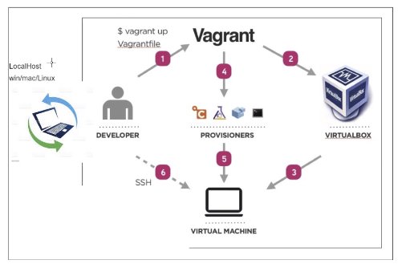

# Start of bootcamp training
## Life before Devops
- Waterfall method
- Transition to Agile and Scrum
## Why DevOps
- Set of practices
- Intended to reduce the time between commits
### Devops Pillars
- Ease of Use
- Flexibility
- Robustness
- Cost Effectiveness
#### Monolith Architecture, one tier
### Vagrant file
- vagrant ssh (to access Vm terminal)
- sudo apt-get upgrade -y (to auto upgrade(-y gives permission))
- sudo apt-get install nginx -y (to install "nginx" (replace with whatever package) with auto permission)
- systemctl status nginx (check if its installed)
- sudo systemctl stop nginx (to stop the package (needs admin rights))
- sudo systemctl start nginx (to start package again)
- exit (to exit the console)

