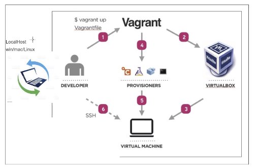

# Start of bootcamp training
## Life before Devops
- Waterfall method
- Transition to Agile and Scrum
## Why DevOps
- Set of practices
- Intended to reduce the time between commits
- Allows for better collaboration between teams
### Devops Pillars
- Ease of Use
- Flexibility
- Robustness
- Cost Effectiveness
#### Monolith Architecture, one tier
### Vagrant file
- vagrant ssh (to access Vm terminal)
- sudo apt-get upgrade -y (to auto upgrade(-y gives permission))
- sudo apt-get install nginx -y (to install "nginx" (replace with whatever package) with auto permission)
- systemctl status nginx (check if its installed)
- sudo systemctl stop nginx (to stop the package (needs admin rights))
- sudo systemctl start nginx (to start package again)
- exit (to exit the console)

#### Code in vagrant file
```
    Vagrant.configure("2") do |config|


    config.vm.box = "ubuntu/xenial64"
    # creating a virtual machine ubuntu

    # assign private ip to our VM
    config.vm.network "private_network", ip: "192.168.10.100"
    # Ensure to install hostsupdater plugin on local host before rerunning vagrant
    config.hostsupdater.aliases = ["development.local"]


    config.vm.provision :shell, path: "provision.sh"
    end
```
#### Code in provision.sh file
```
    #!/bin/bash
    # update system
    sudo apt-get update -y
    # upgrade system
    sudo apt-get upgrade -y
    # install nginx
    sudo apt-get install nginx -y

    # load nginx on 192.168.10.100
```
#### Some of these can be seen in action in the provision.sh bash script
